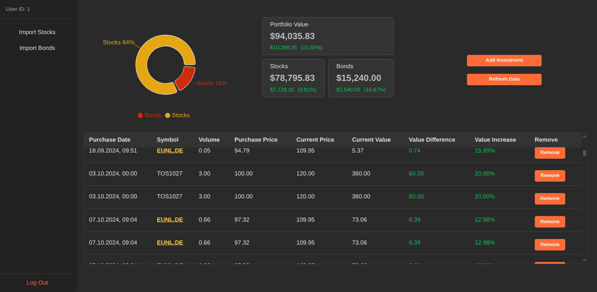
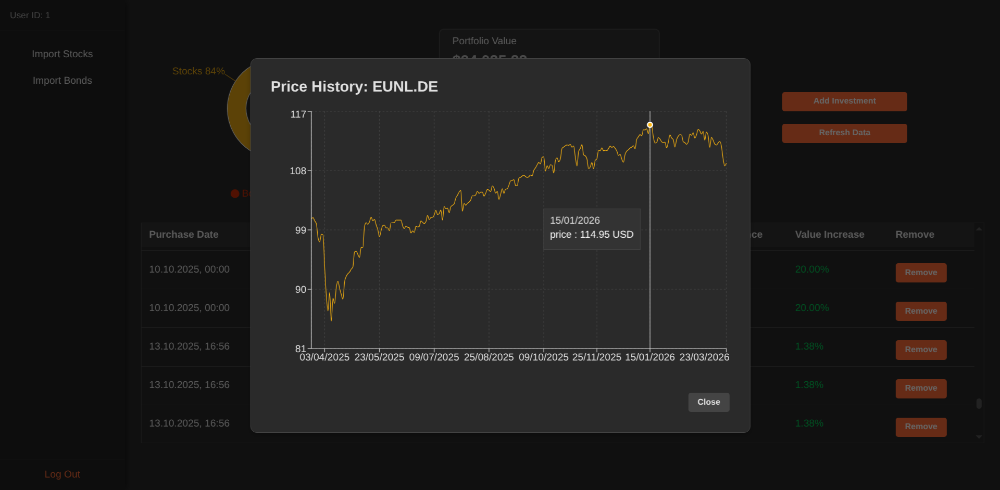

# Investment Tracker

**A full-stack investment management application for tracking performance of diversified portfolios.**

[](https://reactjs.org/)
[](https://fastapi.tiangolo.com/)
[](https://www.postgresql.org/)
[](https://www.docker.com/)


## Live Deployment
The application is currently hosted and accessible at the following URL:

[https://investment-tracker-topaz-seven.vercel.app/](https://investment-tracker-topaz-seven.vercel.app/)

Sign in with demo credentials: 

| Field | Value |
| :--- | :--- |
| **Email** | `demo@example.com` |
| **Password** | `demopassword` |

---

<p align="center">
   
</p>

---

<p align="center">
   
</p>

---

## Features
*   **Frontend-Backend communication:** `REST API` made with `FastAPI`
*   **ORM:** with `SQLAlchemy`
*   **Containerized Infrastructure** using `Docker Compose` and environment variables 
*   **Handling Real Data:** parsing input files in .csv format with `pandas`
*   **Secure Architecture:** using OAuth2 with JWT, rate limiting with `slowapi`
*   **Schema evolution** managed with `Alembic`
configuration.
*   **Real Time Data Updates:** using the Yahoo Finance API
  
---

## Tech Stack
| Component | Technology |
| :--- | :--- |
| **Backend** | FastAPI|
| **Database** | PostgreSQL |
| **Frontend** | React |
| **Authentication** | JWT + OAuth2 |
| **Data Processing** | Pandas |
| **DevOps** | Docker |


## Local Installation and Deployment 
1.  **Configuration:**
    ```bash
    cp backend/.env.example backend/.env
    ```
2.  **Orchestration:**
    ```bash
    docker-compose up --build
    ```
3.  **Endpoint Access:**
    - Application Interface: `http://localhost:5173`
    - API Documentation (OpenAPI): `http://localhost:8000/docs`

---
